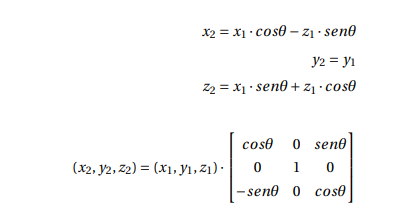

# Rotación en un punto 3D
Practica 2 de CIU
# CIU - Práctica 2
# Rubén García Quintana

## Creando un objeto 3D usando la rotación de un punto. 

La segunda práctica de la asignatura consiste en realizar una aplicación que cree figuras 3D a partir de una traza de puntos inicial.

Aqui podemos ver un gif con una pequeña demostración de su ejecución. 


### Desarrollo de la práctica

Para la realización de esta práctica primero empezamos probando el uso de la clase PShape con objetos 2D y algunos ejemplos que viene en processing.


#### Dibujo del trazado inicial

- Primero necesitabamos detectar las pulsaciones del boton izquierdo del raton, cosa sencilla tras la experiencia con la práctica 1, y despues guardarlo para poder usarlo en un futuro para crear una figura 3D o borrar parte de la traza por algún error. Esto fué sencillo mediante el siguiente código:

```
void mousePressed(){
   if(instrucciones)return;
   if(mouseX>width/2 && objetoFinal==null && instrucciones==false){
       if(mouseButton == RIGHT)objetoInicial.removeLastPoint();
       if(mouseButton == LEFT)objetoInicial.newPoint();
   
   }
 }
 
 .
 .
 .
 
 
 private class Object2D{
   ArrayList puntos = new ArrayList<Float>();
   
   void newPoint(){
     puntos.add((float)mouseX);
     puntos.add((float)mouseY);
     puntos.add((float)0.0);
 }
   ArrayList<Float> getPuntos(){return puntos;}
   void removeLastPoint(){
     if(puntos.isEmpty())return;
     puntos.remove(puntos.size()-1);
     puntos.remove(puntos.size()-1);
     puntos.remove(puntos.size()-1);
 }
   
 }
```

Como vemos, me ayude de una pequeña clase para gestionar los puntos de la traza inicial.

#### Crear el Objeto 3D

- Para este caso se crea una clase llamada "Object3D" que será nuestro objeto a representar. Teniendo los puntos de la traza ahora tenemos que aplicar lo enseñado en clase para conseguir la rotación 3D.




Pasado a código nos quedaría:
```
void crearObjecto3D(){
   
   ArrayList<Float> puntos = objetoInicial.getPuntos();

   for(int i = 0; i < puntos.size() - 3; i=i+3){
     
       float x1=puntos.get(i)-300;
       float z1=puntos.get(i+2);       
       float x2=puntos.get(i+3)-300;
       float z2=puntos.get(i+5);       
       float x1_2;
       float z1_2;
       float x2_2;
       float z2_2;
       
       for(float j=0; j< 361; j+= angulo){         
         x1_2=x1 * cos(angulo) - z1 * sin(angulo);
         z1_2=x1 * sin(angulo) + z1 * cos(angulo);         
         x2_2=x2 * cos(angulo) - z2 * sin(angulo);
         z2_2=x2 * sin(angulo) + z2 * cos(angulo);         

         figura.vertex(x1_2, puntos.get(i+1), z1_2 );
         figura.vertex(x2_2, puntos.get(i+4),z2_2 );                  
          x1=x1_2;
          z1=z1_2;
          x2=x2_2;
          z2=z2_2;
          
       }
   }
 }

```

- Con esto ya solo nos quedaría las condiciones para mostrar o no mostrar la figura y cuando crearla y ya tendriamos el resultado buscado.


## Intrucciones

- Ademas se ha añadido un pequeño manual de instrucciones de uso que se accede mediante la tecla I, para que el primer uso de la aplicación sea más sencilla para el usuario.


      
      
      
